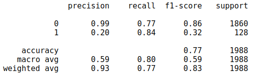

# Quora Insincere Questions Classification


## Objectives

Detect toxic content to improve online conversations

*Source : Kaggle Challenge* : [Quora insincere questions](https://www.kaggle.com/c/quora-insincere-questions-classification)


## Context

Quora is a popular website where anyone can ask and/or answer a question. There are more than 100 millions unique visitors per month.

Like any other forum, Quora is facing a problem: toxic questions and comments.

As you can imagine, Quora teams cannot check all of the Q&A by hand. So they decided to ask the data science community to help them to perform automatically insincere questions classification.


## Getting Started

This project **is coded in Python**.

These instructions will get you a copy of the project up and running on your local machine for development and testing purposes. See deployment for notes on how to deploy the project on a live system.


### Installing

You can create a virtual environment an install different packages with :

```
pip install -r requirements.txt
```

### Dataset

All important files used for my project saved [here](https://drive.google.com/drive/u/0/folders/16ISw88BaAWbCt8d0RZtgZ6biLszrtatS)

📥 The Kaggle dataset is quite heavy and it may be too difficult for my laptop to perform the computations. Therefore, I provide **the train dataset** (to be sampled) and also **light word embeddings**, which I download [here](https://www.kaggle.com/c/quora-insincere-questions-classification/data).

Quora provided a dataset of questions with a label, and the features are the following:

- `qid`: a unique identifier for each question, an hexadecimal number
- `question_text`: the text of the question
- `target`: either 1 (for insincere question) or 0

🔦 In this project, the metric used for performance evaluation is the **F1-score**.


### Import

```
#System library
import os

#Data manipulation
import pandas as pd, numpy as np
from sklearn.utils import resample                                                #Select sample on dataset

#Data storage
import pickle
from joblib import dump, load                                                     #Joblib is more persistent than Pickle for large data, in particular large numpy arrays.

#Data visualization
import matplotlib.pyplot as plt, seaborn as sns

#Text Preprocessing
import nltk
from nltk.tokenize import word_tokenize
from nltk.corpus import stopwords, wordnet
from nltk.stem import WordNetLemmatizer
from tensorflow.keras.preprocessing import text, sequence

#Data Preprocessing
from imblearn.under_sampling import RandomUnderSampler, ClusterCentroids
from imblearn.over_sampling import RandomOverSampler
from sklearn.model_selection import train_test_split
from sklearn.feature_extraction.text import TfidfVectorizer
from sklearn.preprocessing import MinMaxScaler

#Sentiment Analysis
from textblob import TextBlob                                                    
import operator

#Topic Modelling
from gensim.models import TfidfModel
from gensim.corpora import Dictionary
from gensim.models import LsiModel
from pprint import pprint
from gensim.models import LdaModel
import pyLDAvis
import pyLDAvis.gensim

#Supervised Machine Learning Model
from sklearn.ensemble import RandomForestClassifier
from sklearn.linear_model import LogisticRegression

#Deep Learning
from tensorflow.keras.models import Sequential
from tensorflow.keras.layers import SimpleRNN, Dense, Embedding, Dropout
from tensorflow.keras.callbacks import EarlyStopping
from tensorflow.keras.callbacks import TensorBoard

#Metrics computed for Classification
from sklearn.metrics import classification_report, f1_score, accuracy_score
```

I load Quora questions dataset in a pandas dataframe :
```
#Define dataset path :
filepath = os.path.join('data','quora_train.csv')

#Load csv file with pandas dataframe
quora_questions = pd.read_csv(filepath)
```


## 1. Sample dataset : 10 000 rows

First, I sample the dataset to 10.000 lines to can use it on my computer : I use `resample` function from `scikit-learn`.

```
#Sample Quora dataset to 10 000 rows
quora_questions = resample(quora_questions, n_samples=10000, random_state=0)
```

## 2. Exploration Data analysis

### 2.1 Data Exploration

```
#Show the first five rows of data
quora_questions.head()
```
As we can see, the dataset has **three columns** as follows :
- `qid`: a unique identifier for each question, an hexadecimal number
- `question_text`: the text of the question
- `target`: either 1 (for insincere question) or 0

It contains **string** but `target` is **numerical values (discrete)** : It's a **Supervised Machine Learning** case (Classification).

```
quora_questions.info()
```
Next, I display some **statistical summaries** of `target` below : I constat that `target` 0 corresponding to sincere questions is majority.

```
#Statistical summaries of `target`
quora_questions.describe()
```

### 2.2 Data Cleaning

Some relevant informations with **Data Cleaning** are :
- **No null values**
```
#Number of null values
quora_questions.isna().sum()
```
- **45 duplicates**
```
#Number of duplicates
quora_questions.duplicated().sum()


#Drop duplicates
quora_questions.drop_duplicates(inplace=True)
```

### 2.3 Data Analysis

The dataset is highly unbalanced, the **positive class (Quora insincere questions)** account for **6.45%** of all transactions (against **93.55%** for sincere questions) :


Later, I use **oversampling** or **undersampling** method **to balance my dataset** to build Supervised Machine Learning model.


## 3. Data Preparation

### 3.1 Text Preprocessing

To can exploit text, I need to apply **prepocessing tasks** such as **tokenization, lemmatizaton and stemming**. 
- **Tokenization** is the process of splitting a text into words
- **Stemming** keeps only the root of the word (i.e. truncating the word)
- **Lemmatization** adds some context to get the relevant root of a word (infinitive...)

I use `Natural Language Tools Kit (NLTK)` library, it's one of **the most frequently used libraries for NLP**, especially for doing research.

I define a **preprocessing** function and I use `apply` function in pandas to do **preprocessing** on `question_text` column :

```
def get_wordnet_pos(pos_tag):
    '''
    This function uses to transform POS-tagging (what type of word) to tags in Lemmatization.
    
    Parameter
    -------------
    pos_tag : str
        contains POS-tagging of a word  
    
    Returns
    -------------
    output : str
        contains wordnet (tags read by Lemmatizer)
    '''
    output = np.asarray(pos_tag)
    for i in range(len(pos_tag)):
        if pos_tag[i][1].startswith('J'):
            output[i][1] = wordnet.ADJ
        elif pos_tag[i][1].startswith('V'):
            output[i][1] = wordnet.VERB
        elif pos_tag[i][1].startswith('R'):
            output[i][1] = wordnet.ADV
        else:
            output[i][1] = wordnet.NOUN
            
    return output
```

```
def preprocessing_sentence(sentence):
    '''
    This function uses for text preprocessing.
    
    Parameter
    -------------
    sentence : str
        contains text corpus
    
    Returns
    -------------
    lemmatized_sentence : list
        contains list of word tokenized after preprocessing
    '''
    #Tokenize our sentence
    tokens = word_tokenize(sentence)
    
    #Remove punctuation
    tokens = [t.lower() for t in tokens if t.isalpha()]
    
    #Remove stop words : stop words are words that typically add no value to the text
    tokens = [t for t in tokens if t not in stopwords.words("english")]
    
    #Lemmatize tokens
    words_tagged = nltk.pos_tag(tokens)
    tags = get_wordnet_pos(words_tagged)
    lemmatizer = WordNetLemmatizer()
    lemmatized_sentence = [lemmatizer.lemmatize(w_t[0], pos=w_t[1]) for w_t in tags]
    
    return lemmatized_sentence
```
```
quora_questions['tokens'] = quora_questions['question_text'].apply(preprocessing_sentence)
```

### 3.2 Features and labels definitions

I define `X` as **text preprocessed** column and `target` as labe: it takes value 1 in case of incincere questions and 0 otherwise : it represents `y` :
```
#Define X
X = quora_questions['tokens']

#Define y
y = quora_questions['target']
```

I **split** data into **train** and **test** to build model with `train_test_split` method from `Scikit-Learn` :
```
X_train, X_test, y_train, y_test = train_test_split(X, y, 
                                                    test_size=.2,       #train represents 80% of dataset and test represents 20% of dataset
                                                    random_state=0,     #keep the same random split
                                                    stratify=y)         #conserve the same distributions for labels
```

### 3.2 Undersampling to improve model performance

Previously, I constated that my dataset is unbalanced: there are more sincere questions than toxic questions so I use **undersampling method** to **reduce the sincere questions part** and balance `target`: 

```
#Instanciate undersampler
undersampler = RandomUnderSampler(random_state=0)

#Instanciate oversampler
oversampler = RandomOverSampler(random_state=0)
X_train_undersampled, y_train_undersampled = undersampler.fit_resample(np.array(X_train).reshape(-1, 1),      #I reshape X_train to have this form to use RandomUnderSampler : (rows, 1)
                                                                       y_train)
```


### 3.3 Oversampling to improve model performance

I use also **oversampling method** to **compare result with undersampling** :

```
#Instanciate oversampler
oversampler = RandomOverSampler(random_state=0)

#Balance train data
X_train_oversampled, y_train_oversampled = oversampler.fit_resample(np.array(X_train).reshape(-1, 1),      #I reshape X_train to have this form to use RandomUnderSampler : (rows, 1)
                                                                    y_train)
```


### 3.4 Term Frequency - Inverse Document Frequency (TF-IDF)

Words couldn't be use with this form, I transform them into vector using **Term Frequency - Inverse Document Frequency (TF-IDF)** : it's a numerical statistic that is intended to reflect **how important a word is to a document in a collection or corpus.**

```
#Instanciate vector
vectorizer_undersampled = TfidfVectorizer(analyzer=lambda x: x)    #analyzer='word' (default) but I already do text preprocessing
vectorizer_oversampled = TfidfVectorizer(analyzer=lambda x: x)     #analyzer='word' (default) but I already do text preprocessing

#Compute TF-IDF for undersampling
X_train_undersampled = vectorizer_undersampled.fit_transform(X_train_undersampled.ravel()).toarray()  #ravel() : flatten array, toarray() : transform vector into array
X_test_undersampled = vectorizer_undersampled.transform(X_test).toarray()

#Compute TF-IDF for oversampling
X_train_oversampled = vectorizer_oversampled.fit_transform(X_train_oversampled.ravel()).toarray()     #ravel() : flatten array, toarray() : transform vector into array
X_test_oversampled = vectorizer_oversampled.transform(X_test).toarray()
```

Data undersampled counts :
- 3138 words
- 1028 documents

Data oversampled counts :
- 10364 words
- 10364 documents


## 4. Modeling : Using Supervised Machine Learning Model 💻

Logistic Regression and Random Forest are model (from `scikit-learn`) I used to predict incinsere questions.

### 4.1 Logistic Regression

#### 4.1.1 Data undersampled 

```
#Instanciate model
lr_undersampled = LogisticRegression()

#Model fitting
lr_undersampled.fit(X_train_undersampled, y_train_undersampled)

#Model predictions
y_pred_lr_undersampled = lr_undersampled.predict(X_test_undersampled)
```

**Result** : this model is not adapted for detect toxic content because `F1 score = 33.60 %` but `Recall = 83%`

#### 4.1.2 Data oversampled


**Result** : this model is not adapted for detect toxic content because `F1 score = 40.35 %`

### 4.2 Random Forest

#### 4.2.1 Data undersampled 

```
#Instanciate model
rf_undersampled = RandomForestClassifier()

#Model fitting
rf_undersampled.fit(X_train_undersampled, y_train_undersampled)

#Model predictions
y_pred_undersampled = rf_undersampled.predict(X_test_undersampled)
```


**Result** : this model is not adapted for detect toxic content because `F1 score = 35.34 %`

#### 4.2.2 Data oversampled 


**Result** : this model is not adapted for detect toxic content because `F1 score = 23.60 %`.

### 4.3 Sentiment Analysis

**[Sentiment Analysis](https://towardsdatascience.com/sentiment-analysis-concept-analysis-and-applications-6c94d6f58c17)** is the **interpretation and classification of emotions within text data** using text analysis techniques. It's based on two concepts :
1. **Polarity** in sentiment analysis refers to **identifying sentiment orientation (positive, neutral, and negative)** in written or spoken language :
    - **negative feeling** : `value = -1` (minimum)
    - **neutral feeling** : `value = 0`
    - **positive feeling** : `value = 1` (maximum)
    
2. **Subjectivity** is **opinions that describe people’s feelings towards a specific subject or topic** :
    - **objective** : `value = 0` (minimum)
    - **subjective** : `value = 1` (maximum)

I **add features** with **Sentiment Analysis** to improve performance of model by using `TextBlob` library, a simple API for diving into common natural language processing (NLP) tasks such as part-of-speech tagging, noun phrase extraction, sentiment analysis, classification, translation, and more.

```
def get_polarity_mean(tokens):
    '''
    This function computes polarity mean of tokens.
    
    Parameter
    -------------
    tokens : list of str
        contains tokens
    
    Returns
    -------------
    polarity : float
        contains polarity mean of tokens
    '''
    #Replace polarity of tokens empty list by 0 (neutral)
    if len(tokens) == 0:
        return 0
    
    return np.mean([TextBlob(word).sentiment.polarity for word in tokens])

#Compute get_polarity_mean function
quora_questions['polarity'] = quora_questions['tokens'].apply(get_polarity_mean)
```
```
def get_subjectivity_mean(tokens):
    '''
    This function computes subjectivity mean of tokens.
    
    Parameter
    -------------
    tokens : list of str
        contains tokens
    
    Returns
    -------------
    subjectivity : float
        contains subjectivity mean of tokens
    '''
    #Replace subjectivity of tokens empty list by 0 (neutral)
    if len(tokens) == 0:
        return 0
    
    return np.mean([TextBlob(word).sentiment.subjectivity for word in tokens])
    
#Compute get_subjectivity_mean function
quora_questions['subjectivity'] = quora_questions['tokens'].apply(get_subjectivity_mean)
```


I compare `polarity` with `target` to icompute a `confusion matrix` :

```
#Number of good review
nb_good_questions = quora_questions.target.value_counts()[0]

#Number of bad review
nb_bad_questions = quora_questions.target.value_counts()[1]

#Compute confusion matrix for polarity
True_good = quora_questions[quora_questions.polarity > 0][quora_questions.target == 0].shape[0]
print("Polarity positive AND classified as good questions: ", 100 * round(True_good/nb_good_questions, 2), "%")

False_good = quora_questions[quora_questions.polarity < 0][quora_questions.target == 0].shape[0]
print("Polarity negative BUT classified as good questions: ", 100 * round(False_good/nb_good_questions, 2), "%")

True_bad = quora_questions[quora_questions.polarity < 0][quora_questions.target == 1].shape[0]
print("Polarity negative AND classified as bad questions: ", 100 * round(True_bad/nb_bad_questions, 2), "%")

False_bad = quora_questions[quora_questions.polarity > 0][quora_questions.target == 1].shape[0]
print("Polarity positive BUT classified as bad questions: ", 100 * round(False_bad/nb_bad_questions, 1), "%")
```

    Polarity positive AND classified as good questions:  34.0 %
    Polarity negative BUT classified as good questions:  14.000000000000002 %
    Polarity negative AND classified as bad questions:  28.000000000000004 %
    Polarity positive BUT classified as bad questions:  30.0 %

I plot `polarity`, `subjectivity` and `target` to analyze new features :


Correlation matrix graphically gives us an idea of how features correlate with each other and can help us predict what are the features that are most relevant for the prediction :


I can clearly see that all features **don't correlate**.


### 4.4 Word Embeddings

Word Embeddings are a **type of word representation that allows words with similar meaning to have a similar representation** : Vector coordinates are assigned to each word. `Glove` is a library I used for Word Embeddings.

First, I define a **function to read glove model** :
```
#Define file path
glove_file = os.path.join('data', 'glove.6B.50d.txt')

def read_glove_vecs(glove_file):
    '''
    This function returns words and a dictionary of word embeddings.
    
    Parameter
    -------------
    glove_file : str
        contains glove file
    
    Returns
    -------------
    words : list of str
        contains dictionary of word.
    words_to_vec_map : list of float
        contains vectors associated with each words.
    '''
    with open(glove_file, 'r') as f:
        words = []
        word_to_vec_map = {}
        
        for line in f:
            line = line.strip().split()
            curr_word = line[0]
            words.append(curr_word)
            word_to_vec_map[curr_word] = np.array(line[1:], dtype=np.float64)
    
    print(len(words), 'words are in glove dictionary.')
    return words, word_to_vec_map
```
    #Apply read_glove_vecs function
    words, word_to_vec_map = read_glove_vecs(glove_file)

- **400000 words** are in glove dictionary.

- **92.0 % of words on corpus are in dictionary**.
- **8.0 % of words are not on corpus are in dictionary**.

```
def is_in_vocab(tokens):
    '''
    This function analyzes if word of documents are in dictionary or not.
    
    Parameter
    -------------
    tokens : list of str
        contains list of tokens.
    
    Returns
    -------------
    in_vocab : dict of str, int
        contains word in dictionary and word frequency in document.
    out_vocab : list of tuple
        contains words that are not in the dictionary and word frequency in document.
    '''
    in_vocab = {}
    out_vocab = {}
    for token in tokens:
        for word in token:
            if word.lower() in words:
                in_vocab[w] = 1
            elif word in out_vocab.keys():
                out_vocab[word] += 1
            else:
                out_vocab[word] = 1
    
    out_vocab_ordered = sorted(out_vocab.items(), key=operator.itemgetter(1))[::-1]
    
    return in_vocab, out_vocab_ordered
```

I compute word embeddings for corpus of questions:
```
def get_vector(tokens):
    '''
    This function computes word embeddings for documents.
    
    Parameter
    -------------
    tokens : list of str
        contains list of tokens.
    
    Returns
    -------------
    word_vect : array
        contains word embeddings for documents.
    '''
    word_vect = np.array([word_to_vec_map[t] for t in tokens if t in words])
    try:
        word_vect = word_vect.mean(axis=0).astype("float64")
    except:
        print("I can't convert tokens into vector.")
        
    return word_vect
```
    #Apply get_vector function
    quora_questions['vector'] = quora_questions.tokens.apply(get_vector)


### 4.5 Modeling


#### Features and labels definition
```
#Features and labels definition
X = quora_questions.vector

y = quora_questions.target

#Split each coordinates
X = X.apply(lambda x : pd.Series(x))

#Add polarity and subjectivity to X
X = pd.concat([X, quora_questions.polarity, quora_questions.subjectivity], axis=1)
```

#### Logistic Regression

After splitting, scaling and undersampling or oversampling, I have following results :

#### Data undersampled


**Result :** this model is not adapted for detect toxic content because `F1 score = 31.16%` but `Recall = 82%`

#### Data oversampled



**Result :** this model is not adapted for detect toxic content because `F1 score = 32.08%` but `Recall = 84%`

#####  Conclusion : Previous models aren't accacceptable. I will use Deep Learning model.


## 5 Deep Learning : RNN

Sentences are **sequential information** so **I use Recurent Neural Network (RNN)** for text.

```
max_features = 10000

#Tokenization
tokenizer = text.Tokenizer(num_words=max_features)
tokenizer.fit_on_texts(quora_questions['question_text'])
tokenized_sentences = tokenizer.texts_to_sequences(quora_questions['question_text'])

#Padding
maxlen = 53

#Tokens statistic
lengths = [len(seq) for seq in tokenized_sentences]
print('min length:', np.min(lengths))
print('max length:', np.max(lengths))
print('mean length:', np.mean(lengths))
print('median length:', np.median(lengths))
```
    min length: 2
    max length: 53
    mean length: 12.372081320450885
    median length: 11.0
    
```
#Features definition
X = sequence.pad_sequences(tokenized_sentences, maxlen=maxlen)

#Labels definition
y = quora_questions.target

#Split data
X_train, X_test, y_train, y_test = train_test_split(X, y, test_size=0.2, random_state=0)
```
```
#RNN Model
def my_RNN():

    model = Sequential()
    model.add(Embedding(input_dim=max_features, output_dim=32, input_length=maxlen))
    model.add(SimpleRNN(units=32, return_sequences=True))
    model.add(SimpleRNN(units=32, return_sequences=False))
    model.add(Dense(units=1, activation='sigmoid'))

    return model
```
```
model = my_RNN()

model.compile(optimizer='adam',
              loss='binary_crossentropy',
              metrics=['accuracy'])

# Define now our callbacks
callbacks = [EarlyStopping(monitor='val_loss', patience=5),
             TensorBoard(log_dir='./Graph', histogram_freq=0, write_graph=True, write_images=True)]

model.fit(x=X_train, y=y_train, validation_data=(X_test, y_test), epochs=50, batch_size=64, callbacks=callbacks)

#Prediction
y_pred = model.predict_classes(X_test)
```


## Topic Modelling

I identify the most recurrent topics in toxic questions. I use `Gensim` library, a Python library for topic modelling, document indexing and similarity retrieval with large corpora.

### Latent Semantic Analysis (LSA)

**Latent Semantic Analysis** analyzes relationships between a set of documents and the terms they contain by producing a set of concepts (= the topics) related to the documents and terms.

```
#Create a corpus
corpus = quora_questions.tokens

#Compute the dictionary
id2word = Dictionary(corpus)

#Create a BOW
bow = [id2word.doc2bow(line) for line in corpus]  #Convert corpus to BoW format

#Fit a TF-IDF
tfidf_model = TfidfModel(bow)

#Compute the TF-IDF
tf_idf_gensim = tfidf_model[bow]

#Compute LSA
lsi = LsiModel(tf_idf_gensim, id2word=id2word, num_topics=5)

pprint(lsi.print_topics())
```


### Latent Dirichlet Allocation (LDA)

Latent Dirichlet Allocation (LDA) is, in a way, an improvement of the LSA. LDA is a probabilistic model (based on Bayesian probabilities).

```
#Compute the LDA
lda = LdaModel(corpus=tf_idf_gensim, num_topics=5, id2word=id2word, passes=10)

#Print the main topics
pprint(lda.print_topics())
```


#### LDA visualization

```
#Visualize the topics
pyLDAvis.enable_notebook()
vis = pyLDAvis.gensim.prepare(topic_model=lda, corpus=bow, dictionary=id2word)
vis
```

                                                                       
## Go further

- Use spaCy library for Text processing
- Use Word2vec Library for WordEmbedding
- Implement Deep Learning model to detect toxic questions


## Authors

* **Jennifer LENCLUME** - *Data Scientist* - 

For more informations, you can contact me :

LinkedIn : [LinkedIn profile](https://www.linkedin.com/in/jennifer-lenclume-a93728115/?locale=en_US)

Email : <a href="j.lenclume@epmistes.net">j.lenclume@epmistes.net</a>


## Acknowledgments

* Python
* Data Visualization
    - Matplotlib
    - Seaborn
* Exploration Data Analysis
    - Pandas
* Natural Language Processing
    - NLTK
* Text Processing
* Sentiment Analysis : 
    - TextBlob
* Word Embedding :
    - Glove
* Topic Modelling :
    - Gensim
* Machine Learning :
    - Scikit-Learn
* Deep Learning :
    - Tensorflow
    - Keras