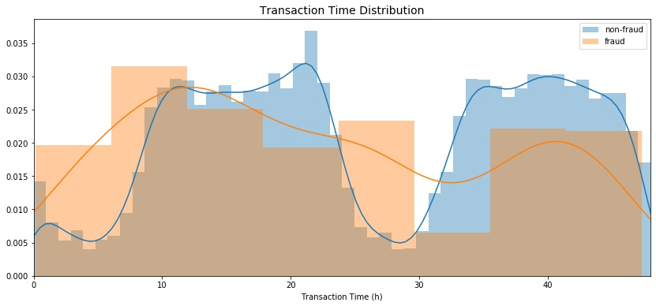
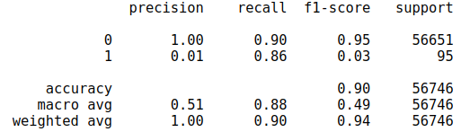
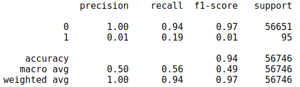

# Credit Card Fraud Detection 💳


          
Photo by <a href="https://burst.shopify.com/@ndekhors?utm_campaign=photo_credit&amp;utm_content=Free+Stock+Photo+of+Computer+Security+Lock+And+Payment+%E2%80%94+HD+Images&amp;utm_medium=referral&amp;utm_source=credit">Nicole De Khors</a> from <a href="https://burst.shopify.com/technology?utm_campaign=photo_credit&amp;utm_content=Free+Stock+Photo+of+Computer+Security+Lock+And+Payment+%E2%80%94+HD+Images&amp;utm_medium=referral&amp;utm_source=credit">Burst</a>


## Objectives 🚀

Identify fraudulent credit card transactions 💳.

*Source : Kaggle Challenge :* [Credit Card Fraud Detection](https://www.kaggle.com/mlg-ulb/creditcardfraud)


## Context

Fraud detection is a billion dollars business 💰: according to the [Nilson Report](https://nilsonreport.com/), credit card fraud adds up to 24 billion dollars in 2018 ! 

Every bank and insurance company has some fraud detection algorithms. They are working hard to find out the fraudulent transactions amongst a huge number of valid ones.

Some companies are doing really good. For instance, Paypal has developed really complicated and efficient algorithms to perform fraud detection.


## Getting Started

This project **is coded in Python**.

These instructions will get you a copy of the project up and running on your local machine for development and testing purposes. See deployment for notes on how to deploy the project on a live system.


### Installing

You can create a virtual environment an install different packages with :

```
pip install -r requirements.txt
```

### Dataset

All important files used for my project saved [here](https://drive.google.com/drive/u/0/folders/12q21VCLoatz58Nr45ATdJmZi33Z2xMot).

📥 I download the dataset on [Kaggle](https://www.kaggle.com/mlg-ulb/creditcardfraud).

The dataset contains transactions made by credit cards in September 2013 by european cardholders.
This dataset presents transactions that occurred in two days, where we have 492 frauds out of 284 807 transactions. The dataset is highly unbalanced, the positive class (frauds) account for 0.17% of all transactions.

It contains only numerical input variables which are the result of a PCA transformation. Unfortunately, due to confidentiality issues, we cannot provide the original features and more background information about the data. The only features which have not been transformed with PCA are `Time` and `Amount`:
- Features `V1`, `V2`, … `V28` are the principal components obtained with PCA
- Feature `Time` contains the seconds elapsed between each transaction and the first transaction in the dataset. 
- The feature `Amount` is the transaction Amount (euros), this feature can be used for example-dependant cost-senstive learning. 
- Feature `Class` is the response variable and it takes value 1 in case of fraud and 0 otherwise

### Import

```
#System library
import os

#Data manipulation
import pandas as pd, numpy as np

#Data storage
import pickle

#Data visualization
import matplotlib.pyplot as plt, seaborn as sns
from mpl_toolkits import mplot3d                                                           #3D visualization
%matplotlib notebook

#Data Preprocessing
from sklearn.preprocessing import StandardScaler                                           #Data scaling
from sklearn.model_selection import train_test_split, GridSearchCV, RandomizedSearchCV     #Data split and hyperparameter                       
from imblearn.over_sampling import SMOTE                                                   #Data oversampling

#Supervised Machine Learning Model
from sklearn.linear_model import LogisticRegression
from sklearn.ensemble import RandomForestClassifier, GradientBoostingClassifier

#Unsupervised Machine Learning Model
from sklearn.covariance import EllipticEnvelope
from sklearn.neighbors import LocalOutlierFactor
from sklearn.ensemble import IsolationForest

#Metrics computed for Classification
from sklearn.metrics import f1_score, accuracy_score, classification_report
from sklearn.metrics import roc_curve
```

## 1. Exploration Data Analysis

I load credit card dataset in pandas dataframe :
```
#Define dataset path :
filepath = os.path.join('data', 'creditcard.csv')

#Load csv file with pandas dataframe
creditcard = pd.read_csv(filepath)
```

### 1.1 Data Cleaning and Exploration

As we can see, the data has **thirty one columns** as follows:
- `V1`, `V2`, … `V28` : principal components obtained with PCA
- `Time`: seconds elapsed between each transaction and the first transaction in the dataset. 
- `Amount`: transaction Amount (euros), this feature can be used for example-dependant cost-senstive learning. 
- `Class`: response variable which takes value 1 in case of fraud and 0 otherwise
```
creditcard.shape

#Show the first five rows of data
creditcard.head()
```
It contains **continue values** but my target (`Class`) is **discrete values** : It's a **Supervised Machine Learning** case (Classification).
```
creditcard.info()
```
Next, I display some **statistical summaries** of the numerical columns below :
- `Amount` mean = 88€
- `Amount` max = 25 691€
- `Time` max = 172 792s (i.e. 48h)

```
#Statistical summaries of the numerical columns
creditcard.describe()
```
Some relevant informations with **Data Cleaning** are :
- **No null values** : 
```
#Number of null values
creditcard.isna().sum()
```
- **1081 duplicates** :
```
#Number of duplicates
creditcard.duplicated().sum()

#Drop duplicates
creditcard.drop_duplicates(inplace=True)
```

### 1.2 Data Analysis

According to Kaggle documentation, `V1` is a result of a PCA Dimensionality reduction to protect user identities and sensitive features (`V1`to `V8`) so I select `Time`, `Amount` and `V1` to visualize my data :


#### Fraudulent/Non-fraudulent transactions distribution :
    
The dataset is highly **unbalanced**, the positive class (frauds) account for **0.17%** of all transactions :


Later, I use **oversampling or undersampling method** to balance my dataset to build Supervised Machine Learning model.

#### Amount transactions distribution :

Most of amount transactions is **lower than 2 000€**, however there is amount higher than 25 000€. I suppose that fraudulent transactions is lower than 2 000€. 


I plot *Transaction Amount* for fraudulent and non-fraudulent transactions to have more precision :


**Fraudulent transactions** amount is **150€ in average**:


#### Time transactions distribution :

Transactions are on **two days** that corresponds to **48 hours** (1 hour = 3600s):  I convert **hour** to **second**.
I constat that transactions time is globaly seasonal.


I notice that fraudulent transactions increase overnight.



#### Features correlation :

Correlation matrix graphically gives us an idea of how features correlate with each other and can help us predict what are the features that are most relevant for the prediction : 


I can clearly see that most of the features **don't correlate to other features** but there are some features that either has a **positive or a negative correlation** with each other. For example, `V12` and `V17` are negatively correlated. 


## 2. Anomaly Detection

Firstly, I build Supervised Machine Learning model to identify fraudulent credit card transactions and secondly I use Unsupervised Machine Learning model to compare results.

### 2.1. Using Supervised Machine Learning 🤖

#### 2.1.1. Features and labels definitions

I select this following features to build `X` :
- `V1`, `V2`, … `V28` : principal components obtained with PCA
- `Time` (in hours): contains the seconds elapsed between each transaction and the first transaction in the dataset. 
- `Amount` (in euros) : transaction amount

```
X = creditcard.iloc[:, :30]
```

Labels are `Class` : it takes value 1 in case of fraud and 0 otherwise : it represents `y` 

```
y = creditcard['Class']
```
I **split** data into **train** and **test** to build model with `train_test_split` method from `scikit-learn` :

```
X_train, X_test, y_train, y_test = train_test_split(X, y, 
                                                    test_size=.2,        #train represents 80% of dataset and test represents 20% of dataset
                                                    random_state=0,      #keep the same random split     
                                                    stratify=y)          #conserve the same distributions for labels
```

#### 2.1.2 Scaling and oversampling to improve model performance

##### Data scaling

I **scale** data, otherwise one feature will be more relevant than the other, for example transaction `Amount` is higher than `V1` (numerically).

```
#Instanciate a scaler
scaler = StandardScaler()

#Scale train and test data
X_train = scaler.fit_transform(X_train)
X_test = scaler.transform(X_test)
```
##### Data oversampling

Credit card dataset is highly unbalanced. I use **oversampling** method to balance dataset and improve model performance: **SMOTE** : it consists to create data for fradulent transactions to balance labels for **train data**.

```
#Instanciate a SMOTE
oversampling = SMOTE()

#Balance train data
X_train, y_train = oversampling.fit_resample(X_train, y_train)
```


#### 2.1.3 Modeling

Logistic Regression, Random Forest and Gradient Boosting are models (from scikit-learn) I used to predict fraudulent transactions.

I build this function to draw prediction later :
```
def graph_prediction(X, y_true, y_pred, model):
    '''This function draw true distribution and predicted distribution transactions for V2 and V1
    
    Parameters
    ------------
    X : array of float
        data to draw
    y_true: array of int
        contains Class transactions
    y_pred: array of int
        contains predictions for fraudulent of non-fraudlent transactions
   
    Returns
    ------------
    Predictions graph
    '''
    fig = plt.figure(figsize=(14, 6))

    fig.add_subplot(121)
    #Plot True distribution V2=f(V1)
    plt.title('True distribution for credit card fraud detection : V2=f(V1)', fontsize=14)
    plt.scatter(X[:, 1], X[:, 2], c=y_true)
    plt.xlabel('V1')
    plt.ylabel('V2')

    fig.add_subplot(122)
    #Plot Predicted distribution V2=f(V1)
    plt.title('Predicted distribution for credit card fraud detection V2=f(V1)', fontsize=14)
    plt.scatter(X[:, 1], X[:, 2], c=y_pred)
    plt.xlabel('V1')
    plt.ylabel('V2')
    
    #Save the graph with plt.savefig
    filepath_prediction = os.path.join('graph', f'credit-card-fraud-prediction-{model}.jpg')
    plt.savefig(filepath_prediction,                                                     #Image path
            format='jpg',                                                                #Image format to save
            bbox_inches='tight')  
    
    plt.show()
```

##### Logistic Regression

I define Logistic Regression function to change hyperparameter :

```
def get_logistic_regression(C=1.0):
    '''
    This function predicts Class transactions with Logistic Regression model
    
    Parameters
    ------------
    C : float, default=1.0
        Inverse of regularization strength; must be a positive float.
        Like in support vector machines, smaller values specify stronger
        regularization.
        
    Returns
    ------------
    y_pred : array of int
        contains predictions for fraudulent of non-fraudlent transactions
    y_pred_proba : array of int
        contains the probability of the predicted class
    '''
    #Instanciate model
    lr = LogisticRegression(C=C)
    
    #Model fitting
    print('Logistic Regression time to fit :')
    %time
    lr.fit(X_train, y_train)

    #Model predictions
    print('\n Logistic Regression time to predict y :')
    %time
    y_pred = lr.predict(X_test)
    print('\n Logistic Regression time to predict y proba :')
    %time
    y_pred_proba = lr.predict_proba(X_test)

    return y_pred, y_pred_proba

```
I predict and evaluate my model with `accuracy_score` and `classification_report` from scikit-learn :

1. Prediction for `C=1.0`:
```
#Prediction for C=1.0
y_pred_lr, y_pred_proba_lr = get_logistic_regression(C=1.0)
```


```
#Compute accuracy score C=1.0
acc_lr = round(accuracy_score(y_test, y_pred_lr), 4) * 100
acc_lr
```
`accuracy_score = 97.23%`


```
print(int(y_pred_lr.sum()), "transactions classified as fraudulent out of", y_test.sum())
```

`1651 transactions classified as fraudulent out of 95`


2. Prediction for `C=0.1`:


`accuracy_score = 97.24%`


`1646 transactions classified as fraudulent out of 95`


3. Prediction for `C=0.01`:


`accuracy_score = 97.26%`


`1646 transactions classified as fraudulent out of 95`

**Result** : Recall of Logistic Regression is 91% but Precision is 5% : this model is not adapted to detect fraudulent transactions because it is not at all precise.

###### ROC Curve

I plot ROC Curve to choose the best model :

```
#Compute ROC characteristic
fpr_lr, tpr_lr, threshold_lr = roc_curve(y_test, y_pred_proba_lr[:, 1])
fpr_lr_c_01, tpr_lr_c_01, threshold_lr_c_01 = roc_curve(y_test, y_pred_proba_lr_c_01[:, 1])
fpr_lr_c_001, tpr_lr_c_001, threshold_lr_c_001 = roc_curve(y_test, y_pred_proba_lr_c_001[:, 1])
```

```
plt.figure(figsize=(10, 8))

#Plot ROC Curve for Logistic Regression
plt.title('ROC Curve for Logistic Regession', fontsize=14)                                #ROC Curve graph Title

#Plot ROC Curve for Logistic Regression for C=1.0
plt.plot(fpr_lr, tpr_lr, label=f'Logistic Regression Classifier Score for Logistic Regression for C=1.0: {acc_lr}%')

#Plot ROC Curve for Logistic Regression for C=0.1
plt.plot(fpr_lr_c_01, tpr_lr_c_01, label=f'Logistic Regression Classifier Score for Logistic Regression for C=0.1: {acc_lr_c_01}%')   

#Plot ROC Curve for Logistic Regression for C=0.01
plt.plot(fpr_lr_c_001, tpr_lr_c_001, label=f'Logistic Regression Classifier Score for Logistic Regression for C=0.01: {acc_lr_c_001}%')

#Plot ROC Curve limited score
plt.plot([0, 1], [0, 1], 'k--')
plt.annotate('Minimum ROC Score of 50% \n (This is the minimum score to get)',           #Plot arrow legend
             xy=(0.5, 0.5),                                                              #The point *(x,y)* to annotate.
             xytext=(0.6, 0.3),                                                          #The position *(x,y)* to place the text at.
             arrowprops=dict(facecolor='#6E726D', shrink=0.05))                          #The properties used to draw a arrow between the positions *xy* and *xytext*.     

#Graph property
plt.xlabel('False Positive Rate', fontsize=12)                                           #Abscissa label
plt.ylabel('True Positive Rate', fontsize=12)                                            #Ordinate label
plt.legend(loc='lower right')                                                            #Graph Legend

#Save the graph with plt.savefig
filepath_roc_curve_lr = os.path.join('graph', 'credit-card-fraud-roc-curve-lr.jpg')
plt.savefig(filepath_roc_curve_lr,                                                       #Image path
            format='jpg',                                                                #Image format to save
            bbox_inches='tight')                                                         #Keep abscissa legend


plt.show()
```


**Result** : ROC AUC of Logistic Regression model for `C=0.01` is better than the other predictions (`C=1.0` and `C=0.1`) but it's not precise.


##### Random Forest Classifier

I define Random Forest Classifier function to change hyperparameter :

```
def get_random_forest_classifier(n_estimators=100, max_depth=50):
    '''
    This function predicts Class transactions with Random Forest Classifier model
    
    Parameters
    ------------
    n_estimators : integer, optional (default=100)
        The number of trees in the forest.
    max_depth : integer or None, optional (default=50)
        The maximum depth of the tree. 
        
    Returns
    ------------
    y_pred : array of int
        contains predictions for fraudulent of non-fraudlent transactions
    y_pred_proba : array of int
        contains the probability of the predicted class
    '''
    #Instanciate model
    rf = RandomForestClassifier(n_estimators=n_estimators, max_depth=max_depth)
    
    #Model fitting
    print('Random Forest Classifier time to fit :')
    %time
    rf.fit(X_train, y_train)

    #Model predictions
    print('\n Random Forest Classifier time to predict y :')
    %time
    y_pred = rf.predict(X_test)
    print('\n Random Forest Classifier time to predict y proba :')
    %time
    y_pred_proba = rf.predict_proba(X_test)

    return y_pred, y_pred_proba
```
I predict and evaluate my model with `accuracy_score` and `classification_report` from scikit-learn :

1. Prediction for `n_estimators=100, max_depth=50` :
```
#Prediction for n_estimators=100, max_depth=50
y_pred_rf, y_pred_proba_rf = get_random_forest_classifier(n_estimators=100, max_depth=50)
```


`accuracy_score = 99.96%`

`87 transactions classified as fraudulent out of 95`


2. Prediction for `n_estimators=100, max_depth=None` :


`accuracy_score = 99.96%`

`84 transactions classified as fraudulent out of 95`


3. Prediction for `n_estimators=50, max_depth=None` :


`accuracy_score = 99.96%`

`86 transactions classified as fraudulent out of 95`

**Result** : Recall of Random Forest Classifier (`n_estimators=100, max_depth=None`) is 84%, Precision is 93% : this model is adapted to detect fraudulent transactions because F1 score is better than the other prediction (`f1_score=88%`).

###### ROC Curve

I plot ROC Curve to choose the best model :


**Result**: I validate Random Forest model for `n_estimators = 100, max_depth = None` because the ROC score and F1 score are better.


#### 2.1.3 Gradient Boosting

```
def get_gradient_boosting(learning_rate=0.1, n_estimators=100, max_depth=3, random_state=0):
    '''
    This function predicts Class transactions with Gradient Boosting Classifier model
    
    Parameters
    ------------
    learning_rate : float, optional (default=0.1)
        learning rate shrinks the contribution of each tree by `learning_rate`.
        There is a trade-off between learning_rate and n_estimators.
    n_estimators : int (default=100)
        The number of boosting stages to perform. Gradient boosting
        is fairly robust to over-fitting so a large number usually
        results in better performance.
    max_depth : integer, optional (default=3)
        maximum depth of the individual regression estimators. The maximum
        depth limits the number of nodes in the tree.
    random_state : int,
        RandomState instance or None, optional (default=0)
          
    Returns
    ------------
    y_pred : array of int
        contains predictions for fraudulent of non-fraudlent transactions
    y_pred_proba : array of int
        contains the probability of the predicted class
    '''
    #Instanciate model
    boost = GradientBoostingClassifier(learning_rate=learning_rate, n_estimators=n_estimators, max_depth=max_depth, random_state=random_state)
    
    #Model fitting
    print('Gradient Boosting Classifier time to fit :')
    %time
    boost.fit(X_train, y_train)

    #Model predictions
    print('\nGradient Boosting Classifier time to predict y :')
    %time
    y_pred = boost.predict(X_test)
    print('\nGradient Boosting Classifier time to predict y proba :')
    %time
    y_pred_proba = boost.predict_proba(X_test)

    return y_pred, y_pred_proba
```
```
#Prediction for learning_rate=0.1, n_estimators=100, max_depth=3, random_state=0
y_pred_boost, y_pred_proba_boost = get_gradient_boosting()
```
`accuracy_score = 98.44%`


`964 transactions classified as fraudulent out of 95`


**Result**: This model isn't adequate to detect fraudulent transaction because f1_score is lower (`f1_score=16%`) : it is not at all precise.

##### ROC Curve


##### Conclusion

I plot ROC Curve for Supervised Machine Learning models and I validate Random Forest model for `n_estimators = 100, max_depth = None` (ROC score and F1 score is higher).


### 2.2 Using Unsupervised Machine Learning 🤖

I import data scaled (unbalanced) from the last part.
```
#Import train and test data on local file
filepath_creditcard_train_test = os.path.join('data', 'creditcard_train_test_scaled.pkl')

with open(filepath_creditcard_train_test, 'rb') as f:
    (X_train, X_test, y_train, y_test) = pickle.load(f)
```
Here, I implement Gaussian Distribution based, Local Outlier Factor and Isolation Forest to detect fraudulent transactions. 

**Prerequisite** : I reduce my data to non fraudulent transactions to fit Anomaly Detection models.


#### 2.2.1 Gaussian Distribution based

I define Logistic Regression function :

```
def get_gaussian_distribution_based():
    '''
    This function predicts Class transactions with Gaussian Distribution based model
    
    Parameters
    ------------

    Returns
    ------------
    y_pred : array of int
        contains predictions for fraudulent of non-fraudlent transactions
    y_pred_proba : array of int
        contains the probability of the predicted class
    '''
    #Instanciate model
    covariance = EllipticEnvelope(random_state=0, support_fraction=1)
    
    #Model fitting
    print('Gaussian Distribution based time to fit :')
    %time
    covariance.fit(X_train)

    #Model predictions
    print('\nGaussian Distribution based time to predict y :')
    %time
    y_pred = covariance.predict(X_test)
    print('\nGaussian Distribution based time to predict y proba :')
    %time
    y_pred_proba = covariance.score_samples(X_test)
    return y_pred, y_pred_proba
```
I predict and evaluate my model with `accuracy_score` and `classification_report` from scikit-learn :
```
#Prediction :
y_pred_covariance, y_pred_proba = get_gaussian_distribution_based()
```
```
#Predict returns 1 for an inlier and -1 for an outlier
y_pred_covariance[y_pred_covariance == 1] = 0
y_pred_covariance[y_pred_covariance == -1] = 1
```
`accuracy_score = 89.70%`



**Result**: Recall of Gaussian Distribution Based is 86% but precision is 1% : Gaussian Distribution Based is not adapted to detect fraudulent transactions (`f1_score=3%`).

`5912 transactions classified as fraudulent out of 95`


##### ROC Curve

I define a function to plot ROC Curve :

```
def graph_roc_curve(figsize, title, fpr, tpr, label, accuracy, model_name):
    '''
    This function draw a ROC Curve
    
    Parameters
    ------------
    figsize : tuple of int
        figure dimension
    title : str
        Graph title
    fpr : array, shape = [>2]
        Increasing false positive rates such that element i is the false
        positive rate of predictions with score >= thresholds[i].
    tpr :array, shape = [>2]
        Increasing true positive rates such that element i is the true
        positive rate of predictions with score >= thresholds[i].
    label : str
        Graph label
    accuracy : float
        accuracy_score
    model_name : str
        model name to save figure

    Returns
    ------------
    y_pred : array of int
        contains predictions for fraudulent of non-fraudlent transactions
    y_pred_proba : array of int
        contains the probability of the predicted class
    '''
    plt.figure(figsize=figsize)

    #Plot ROC Curve for Supervised Machine Learning Model
    plt.title(title, fontsize=14)                                                        #ROC Curve graph Title

    #Plot ROC Curve
    plt.plot(fpr, tpr, label=f'{label} : {accuracy}%')           

    #Plot ROC Curve limited score
    plt.plot([0, 1], [0, 1], 'k--')
    plt.annotate('Minimum ROC Score of 50% \n (This is the minimum score to get)',       #Plot arrow legend
             xy=(0.5, 0.5),                                                              #The point *(x,y)* to annotate.
             xytext=(0.6, 0.3),                                                          #The position *(x,y)* to place the text at.
             arrowprops=dict(facecolor='#6E726D', shrink=0.05))                          #The properties used to draw a arrow between the positions *xy* and *xytext*.     

    #Graph property
    plt.xlabel('False Positive Rate', fontsize=12)                                       #Abscissa label
    plt.ylabel('True Positive Rate', fontsize=12)                                        #Ordinate label
    plt.legend(loc='lower right')                                                        #Graph Legend
    
    #Save the graph with plt.savefig
    filepath_roc_curve = os.path.join('graph', f'credit-card-fraud-roc-{model_name}.jpg')
    plt.savefig(filepath_roc_curve,                                                      #Image path
            format='jpg',                                                                #Image format to save
            bbox_inches='tight')   
    
    plt.show()
```

```
#Compute ROC characteristic
fpr_cov, tpr_cov, threshold_cov = roc_curve(y_test, y_pred_covariance)

#Plot ROC Curve
graph_roc_curve((10, 8), 'ROC Curve Gaussian Distribution Based', fpr_cov, tpr_cov, 'ROC Curve DGB', acc_cov, 'gdb')
```


#### 2.2.2 Local Outlier Factor

```
def get_local_outlier_factor(n_neighbors=20):
    '''
    This function predicts Class transactions with LOF model
    
    Parameters
    ------------
    n_neighbors : int, optional (default=20)
        Number of neighbors to use by default for :meth:`kneighbors` queries.
        If n_neighbors is larger than the number of samples provided,
        all samples will be used.
        

    Returns
    ------------
    y_pred : array of int
        contains predictions for fraudulent of non-fraudlent transactions
    y_pred_proba : array of int
        contains the probability of the predicted class
    '''
    #Instanciate model
    local_outlier = LocalOutlierFactor(n_neighbors=n_neighbors, 
                                       novelty=True)                      #novelty=True because X_train (fit) and X_test (predict) is different
    
    #Model fitting
    print('LOF time to fit :')
    %time
    local_outlier.fit(X_train)

    #Model predictions
    print('\nLOF time to predict y :')
    %time
    y_pred = local_outlier.predict(X_test)
    print('\nLOF time to predict y proba :')
    %time
    y_pred_proba = -local_outlier.score_samples(X_test)                   #LOF returns negative score 
    
    return y_pred, y_pred_proba
```
```
#Prediction :
y_pred_lof_neigh_20, y_pred_proba_lof_neigh_20 = get_local_outlier_factor(n_neighbors=20)

#Predict returns 1 for an inlier and -1 for an outlier
y_pred_lof_neigh_20[y_pred_lof_neigh_20 == 1] = 0
y_pred_lof_neigh_20[y_pred_lof_neigh_20 == -1] = 1
```


`accuracy_score = 93.83%`

`3445 transactions classified as fraudulent out of 95`


**Result**: This model is not adequate to detect fraudulent transaction because recall and precision is very lower. 
To improve model performance, I will increase numbers of n_neighbors but LOF computation is very high.

##### ROC Curve


#### 2.2.3 Isolation Forest

```
def get_isolation_forest(n_estimators=100, contamination="auto", random_state=0):
    '''
    This function predicts Class transactions with Isolation Forest model
    
    Parameters
    ------------
    n_estimators : int, optional (default=100)
        The number of base estimators in the ensemble.
    contamination : 'auto' or float, optional (default='auto')
        The amount of contamination of the data set, i.e. the proportion
        of outliers in the data set. 
    behaviour : str, default='new'
        This parameter has not effect, is deprecated, and will be removed.
    random_state : int, 
        RandomState instance or None (default=0)
    
    Returns
    ------------
    y_pred : array of int
        contains predictions for fraudulent of non-fraudlent transactions
    y_pred_proba : array of int
        contains the probability of the predicted class
    '''
    #Instanciate model
    isol_forest = IsolationForest(n_estimators=n_estimators, contamination=contamination, random_state=random_state)

    #Model fitting
    print('IF time to fit :')
    %time
    isol_forest.fit(X_train)

    #Model predictions
    print('\nIF time to predict y :')
    %time
    y_pred = isol_forest.predict(X_test)
    print('\nIF time to predict y proba :')
    %time
    y_pred_proba = -isol_forest.score_samples(X_test)                         #IF returns negative score 
    
    return y_pred, y_pred_proba
```

```
#Prediction :
y_pred_if_est_100, y_pred_proba_if_est_100 = get_isolation_forest()

#Predict returns 1 for an inlier and -1 for an outlier
y_pred_if_est_100[y_pred_if_est_100 == 1] = 0
y_pred_if_est_100[y_pred_if_est_100 == -1] = 1
```

`accuracy_score = 95.94%`


**Result**: This model is not adequate to detect fraudulent transaction because f1_score is very lower (`f1_score=6%`) : it is not at all precise.

##### ROC Curve


## Conclusion

Precision as the name says, says how precise (how sure) is our model in detecting fraud transactions while recall is the number of fraud cases our model is able to detect : I would like to have a high recall for fraud prediction and high F1 score.

Logistic Regresion, Gradient Boosting, Gaussian Distribution Based, Local Outlier Factor and Isolation Forest has a lower F1 score but **Random Forest Classifier** as **88% of F1 score** : It's the best model to detect fraudulent transactions.


`accuracy_score = 99.96%`

`84 transactions classified as fraudulent out of 95`


## Go further

My research can be improved by following step to add : 
- 3D Data visualization
- Compute Learning Rate for each models to correct overfitting/underfitting (Regularization)
- Apply Grid Search/Random Search method for model parameter optimization 
- Apply undersampling method to balance data for Classification
- Implement Deep Learning model to detect fraudulent transactions : AutoEncoders


## Authors

* **Jennifer LENCLUME** - *Data Scientist* - 

For more informations, you can contact me :

LinkedIn : [LinkedIn profile](https://www.linkedin.com/in/jennifer-lenclume-a93728115/?locale=en_US)

Email : <a href="j.lenclume@epmistes.net">j.lenclume@epmistes.net</a>


## Acknowledgments

* Python
* Data Visualization
* Exploration Data Analysis
* Machine Learning : Anomaly Detection
