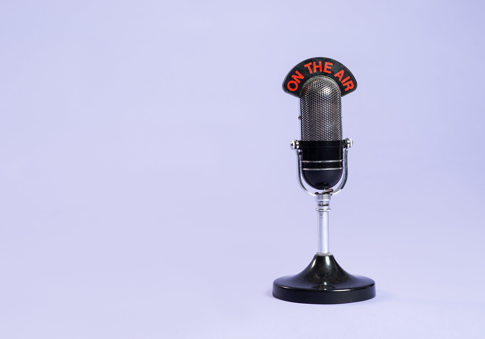
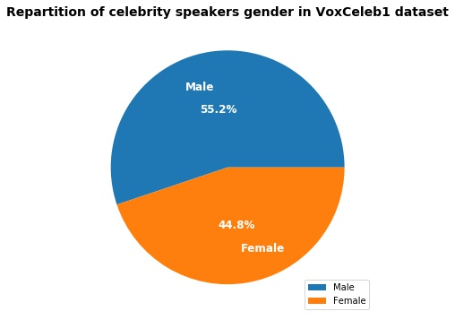
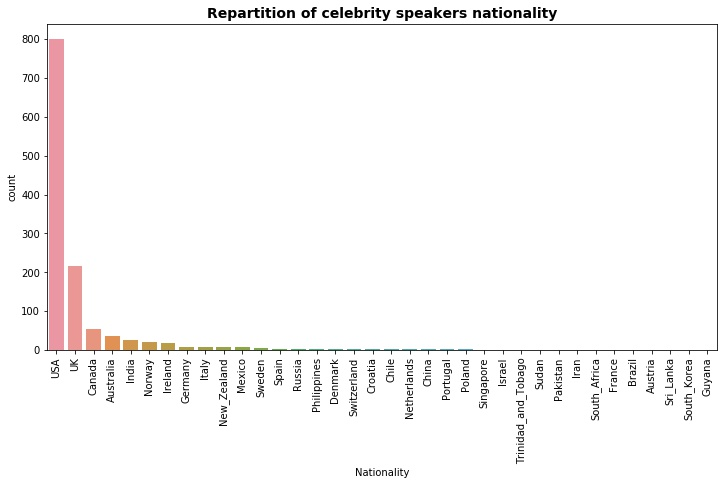

# CelebVoice, Celebrity Speech Recognition



Photo by <a href="https://burst.shopify.com/@lightleaksin?utm_campaign=photo_credit&amp;utm_content=Browse+Free+HD+Images+of+Retro+Radio+Microphone+Against+Purple+Background&amp;utm_medium=referral&amp;utm_source=credit">Samantha Hurley</a> from <a href="https://burst.shopify.com/vintage?utm_campaign=photo_credit&amp;utm_content=Browse+Free+HD+Images+of+Retro+Radio+Microphone+Against+Purple+Background&amp;utm_medium=referral&amp;utm_source=credit">Burst</a>


## Objectives 🚀

Recognize celebrity speakers from any speech :
[Project Plan](https://docs.google.com/presentation/d/16wNe2B3FZuiwzTYpEq4Us9K1lSrWAeuP5wIO_sBCzRY/edit?usp=sharing)

*Source : VoxCeleb Speaker Recognition Challenge (VoxSRC - University of Oxford) :* [VoxCeleb Speaker Recognition Challenge (VoxSRC)](http://www.robots.ox.ac.uk/~vgg/data/voxceleb/competition.html)


## Context

I choose this project because I am fascinated by audio synthesis and I decide to study voice recognition part to begin.


## Getting Started

This project is **coded in Python**.

These instructions will get you a copy of the project up and running on your local machine for development and testing purposes. 
This project is under development, you can see a part of my work in [Final-project.ipynb](https://github.com/Jennifer974/my-projects/blob/master/final-project-vivadata-03-2020/Final-Project.ipynb) jupyter notebook.


### Prerequisites

- I read documentation on voiceprint to can identify each celebrity voice and audio signal processing :

1.  [*From Natural to Artificial Intelligence - Algorithms and Applications* : Some Commonly Used Speech Feature Extraction Algorithms (book extract)](https://www.intechopen.com/books/from-natural-to-artificial-intelligence-algorithms-and-applications/some-commonly-used-speech-feature-extraction-algorithms)

2. [Deep Learning course : keywords voice recognition](https://deeplylearning.fr/cours-pratiques-deep-learning/reconnaissance-vocale-de-mots-cles/)

3. [Voice Gender Identification project](https://maelfabien.github.io/machinelearning/Speech11/#)

4. [Voice Classification with Neural Networks project](https://towardsdatascience.com/voice-classification-with-neural-networks-ff90f94358ec)


### Installing

- I crate a virtual environment for my project to can export it later and avoid versioning issue. I install different packages with `requirements.txt` : 

```
pip install -r requirements.txt
```
- I install LibROSA library, a python package for music and audio analysis : [LibROSA - librosa 0.7.2 documentation](https://librosa.github.io/librosa/)

- I install pyAudio library to play and record audio : [PyAudio - documentation](https://people.csail.mit.edu/hubert/pyaudio/docs/)


### Import

```
#System library to manipulate folders...
import sys, os, shutil

#I use a virtual environment for my project : venv
sys.path.append('/home/jlenclume/code/Jennifer974/my_projects/final-project-vivadata-03-2020/venv/lib/python3.7/site-packages')

#Data Manipulation
import pandas as pd, numpy as np

#Feature extraction
import librosa               #Audio library

#To play audio
import pyaudio

#Data Storage
import pickle

#Data visualization
import matplotlib.pyplot as plt, seaborn as sns
import librosa.display

#Deep Learning Model
from tensorflow.keras.preprocessing.image import ImageDataGenerator
from tensorflow.keras.models import Sequential
from tensorflow.keras.layers import Dense, Conv2D, MaxPool2D, Flatten, Dropout
```


### Dataset

All important files used for my project saved here [Final Project data](https://drive.google.com/drive/u/0/folders/1qvcWw5RyMjSaWA3ft_THVjGptLy_09Rt)

📥 I download the VoxCeleb1 dataset on : [VoxCeleb : A large scale audio-visual dataset of human speech](http://www.robots.ox.ac.uk/~vgg/data/voxceleb/index.html#portfolio) :

- I am limited to use the VoxCeleb1 dataset because is lower than which give by the VoxSRC Challenge and my CPU will support it.
- It contains 148 642 audio files (format : wav - duration : 5s in average) extracted from YouTube videos of celebrity interviews : 1251 celebrity speakers :
- My data is labelised : Using Supervised Machine Learning Model
- My targets are discrete values : I am in Classification case and I use Deep Learning model

#### Celebrity speakers dataset (`vox1_meta.csv`) : Exploration Data Analysis

I load celebrity speakers dataset in pandas dataframe :

```
#Define dataset path :
filepath = os.path.join('..', '..', '..', '..', 'Documents', 'Final-Project-data', 'vox1_meta.csv')

#Load csv file with pandas dataframe
celebrity_speakers_data = pd.read_csv(filepath, 
                                      delim_whitespace=True)         #Each element is separated by spaces
```

##### Data Exploration

As we can see, my dataframe has 1251 rows corresponding to number of celebrity speakers interviewed and 5 columns corresponding to :

1. `VoxCeleb1_ID` : celebrity speakers ID
2. `VGGFace1_ID` : celebrity speakers names
3. `Gender` : celebrity speakers gender
4. `Nationality` : celebrity speakers nationality
5. `Set` : if celebrity will use for train (development) or test model part

```
celebrity_speakers_data.shape

#Show the first five rows of data
celebrity_speakers_data.head()
```

All my dataframe is string type and it seems there aren't null values :
```
celebrity_speakers_data.info()
```

##### Data Cleaning

Some relevant informations with data cleaning are :

- No null values :
```
#Numbers of null values
celebrity_speakers_data.isna().sum()
```
- No duplicates :
```
#Numbers of duplicastes
celebrity_speakers_data.duplicated().sum()
```

##### Data Analysis

It is usefully to plot `Gender` and `Nationality` repartitionfor celebrity speakers :

###### Gender Repartition

I use `get_dummies` function to transform `Gender` into numerical values :

```
celebrity_speakers_data['Gender'] = pd.get_dummies(celebrity_speakers_data['Gender'], 
                                                   prefix='Gender',                     #Rename columns
                                                   drop_first=True)                     #Drop the frist columns 
```

```
plt.figure(figsize=(8,6))

textprops={'color': 'w', 'size': 12, 'weight': 'bold'}                      #Text property
labels = ['Male', 'Female']                                                 #Gender labels

plt.pie(x=celebrity_speakers_data['Gender'].value_counts(), 
        labels=labels, 
        autopct='%1.1f%%',                                                  #Labels proportion
        pctdistance=.5, 
        labeldistance=.7, 
        textprops=textprops)                                                #Text property

plt.title('Repartition of celebrity speakers gender in VoxCeleb1 dataset',  #Diagram title
          fontdict={'size': 14, 'fontweight' : 'bold'})                     #Title property

plt.legend(loc='lower right')                                               #Legend location

# I save this graph with plt.savefig
filepath_fig_nationality = os.path.join('graph', 'Celebrity-speakers-gender-in-VoxCeleb1-dataset.jpg')
plt.savefig(filepath_fig_nationality,                                       #Image path
            format='jpg',                                                   #Image format to save
            bbox_inches='tight')                                            #keep all graph bottom

plt.show()
```



The repartition in celebrity speakers between men and women is equal.

###### Nationality Repartition

```
plt.figure(figsize=(12, 6))

plt.title('Repartition of celebrity speakers nationality', fontweight="bold", size=14)  #Diagram title

sns.countplot(x='Nationality',
              data=celebrity_speakers_data,
              order=celebrity_speakers_data['Nationality'].value_counts().index)        #Order values by ascending

plt.xticks(rotation=90)                                                                 #Abscissa label positioning

# I save this graph with plt.savefig
filepath_fig_nationality = os.path.join('graph', 'Celebrity-speakers-nationality-repartion.jpg')
plt.savefig(filepath_fig_nationality,                                                   #Image path
            format='jpg',                                                               #Image format to save
            bbox_inches='tight')                                                        #Keep all graph bottom

plt.show()
```



I constat that American and Englishman are majority so I keep them for my project.

```
celebrity_speakers_data_limited = celebrity_speakers_data.loc[(celebrity_speakers_data['Nationality'] == 'USA') | (celebrity_speakers_data['Nationality'] == 'UK')]
```
The new dataset as 1014 celebrity speakers.

I use `get_dummies` function to transform `Nationality` column into numerical values : 1 for American and 0 for Englishman :
```
celebrity_speakers_data_limited['Nationality'] = pd.get_dummies(celebrity_speakers_data_limited['Nationality'], drop_first=True, prefix='Nationality')
```

##  1. Audio files Analysis

### 1.1 Data Comprehension

Now, I explore my audio files downloaded to analyze architecture :

```
ls ../../../../Documents/Final-Project-data/vox1_dev_wav/wav/id11109/410TXiXAVeU
```

Audio Files is classified by `celebrity ID` and interview.
For example, I choose two celebrity ID : id10965 corresponds to Regina_Hall and id11109	corresponds to Stephen Baldwin :


Reginal Hall
Photo from <a href='https://fr.wikipedia.org/wiki/Regina_Hall'> wikipedia </a>

```
celebrity_speakers_data_limited.loc[celebrity_speakers_data_limited['VoxCeleb1_ID'] == 'id10965']
```


Stephen Baldwin
Photo from <a href='https://fr.wikipedia.org/wiki/Stephen_Baldwin'> wikipedia </a>

```
celebrity_speakers_data_limited.loc[celebrity_speakers_data_limited['VoxCeleb1_ID'] == 'id11109']
```

I observe that there are several audios for each speaker in folders. I would like to add audio files in my dataframe to can exploit them later so I create a bash script `[move_audio_files.sh](https://github.com/Jennifer974/my-projects/blob/master/final-project-vivadata-03-2020/move_audio_files.sh)` to gather and rename audio files with the following format `celebrity_ID-Interview_ID-audio_part_number`.

I copy 148 642 audios.
```
#Audio folder path
filepath_audio_files = os.path.join('..', '..', '..', '..', 'Documents', 'Final-Project-data', 'vox1_dev_wav', 'audio_files')

#List of audio files
audio_names = os.listdir(filepath_audio_files)

#Total number of celebrity speakers audios
len(audio_names)  
```
I reduce the size of my dataset thank to previously study (Nationality selection : USA and UK) and I keep 10 000 audios to can fit Machine Learning models in my computer : 

```
list_audio = []
list_celeb_id = []

for audio_name in audio_names:
    for celeb_id in celebrity_speakers_data_limited['VoxCeleb1_ID']:
        
        #I compare celebrity ID in audio name : celebrity_ID-Interview_ID-audio_part_number
        if celeb_id == audio_name.split('-')[0]:
            
            #I add audio files corresponding to my selection in an empty list
            list_audio.append(audio_name)

len(list_audio)                             #148 642 audios
list_audio = list_audio[:10000]             #10 000 audios 

#list comprehension to retrieve celeb_id corresponding to audio name
celeb_id = [audio_name.split('-')[0] for audio_name in list_audio]
```

## Authors

* **Jennifer LENCLUME** - *Data Scientist* - 

For more informations, you can contact me :

LinkedIn : [LinkedIn profile](https://www.linkedin.com/in/jennifer-lenclume-a93728115/?locale=en_US)

Email : <a href="j.lenclume@epmistes.net">j.lenclume@epmistes.net</a> 


## Acknowledgments

* Python 
* Data Visualization
* Exploration Data Analysis
* Machine Learning
* Deep Learning : Convolutional Neural Networks
* Audio Treatment
