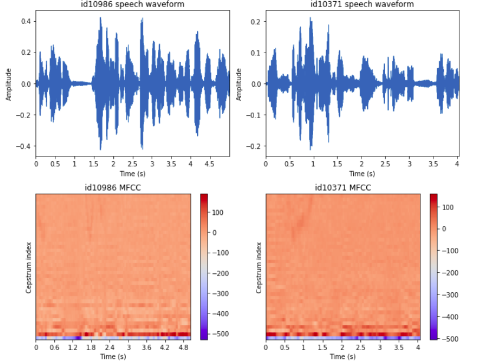
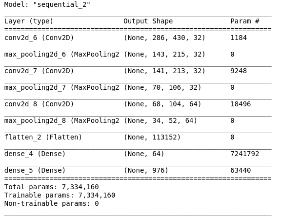

# CelebVoice, Celebrity Speech Recognition


Photo by <a href="https://burst.shopify.com/@lightleaksin?utm_campaign=photo_credit&amp;utm_content=Browse+Free+HD+Images+of+Retro+Radio+Microphone+Against+Purple+Background&amp;utm_medium=referral&amp;utm_source=credit">Samantha Hurley</a> from <a href="https://burst.shopify.com/vintage?utm_campaign=photo_credit&amp;utm_content=Browse+Free+HD+Images+of+Retro+Radio+Microphone+Against+Purple+Background&amp;utm_medium=referral&amp;utm_source=credit">Burst</a>


## Objectives 🚀

Recognize celebrity speakers from any speech :
[Project Plan](https://docs.google.com/presentation/d/16wNe2B3FZuiwzTYpEq4Us9K1lSrWAeuP5wIO_sBCzRY/edit?usp=sharing)

*Source : VoxCeleb Speaker Recognition Challenge (VoxSRC - University of Oxford) :* [VoxCeleb Speaker Recognition Challenge (VoxSRC)](http://www.robots.ox.ac.uk/~vgg/data/voxceleb/competition.html)


## Context

I choose this project because I am fascinated by audio synthesis and I decide to study voice recognition part to begin.


## Getting Started

This project is **coded in Python**.

These instructions will get you a copy of the project up and running on your local machine for development and testing purposes. 
This project is under development, you can see a part of my work in [Final-project.ipynb](https://github.com/Jennifer974/my-projects/blob/master/final-project-vivadata-03-2020/Final-Project.ipynb) jupyter notebook.


### Prerequisites

- I read documentation on voiceprint to can identify each celebrity voice and audio signal processing :

1.  [*From Natural to Artificial Intelligence - Algorithms and Applications* : Some Commonly Used Speech Feature Extraction Algorithms (book extract)](https://www.intechopen.com/books/from-natural-to-artificial-intelligence-algorithms-and-applications/some-commonly-used-speech-feature-extraction-algorithms)

2. [Deep Learning course : keywords voice recognition](https://deeplylearning.fr/cours-pratiques-deep-learning/reconnaissance-vocale-de-mots-cles/)

3. [Voice Gender Identification project](https://maelfabien.github.io/machinelearning/Speech11/#)

4. [Voice Classification with Neural Networks project](https://towardsdatascience.com/voice-classification-with-neural-networks-ff90f94358ec)


### Installing

- I crate a virtual environment for my project to can export it later and avoid versioning issue. I install different packages with `requirements.txt` : 

```
pip install -r requirements.txt
```
- I install LibROSA library, a python package for music and audio analysis : [LibROSA - librosa 0.7.2 documentation](https://librosa.github.io/librosa/)

- I install pyAudio library to play and record audio : [PyAudio - documentation](https://people.csail.mit.edu/hubert/pyaudio/docs/)


### Import

```
#System library to manipulate folders...
import sys, os, shutil

#I use a virtual environment for my project : venv
sys.path.append('/home/jlenclume/code/Jennifer974/my_projects/final-project-vivadata-03-2020/venv/lib/python3.7/site-packages')

#Data Manipulation
import pandas as pd, numpy as np

#Feature extraction
import librosa                                                                       #Audio library

#To play audio
import pyaudio

#Data Storage
import pickle

#Data visualization
import matplotlib.pyplot as plt, seaborn as sns
import librosa.display

#Data Preprocessing
from sklearn.model_selection import train_test_split                                 #Data split

#Deep Learning Model
from tensorflow.keras.preprocessing.image import ImageDataGenerator
from tensorflow.keras.models import Sequential
from tensorflow.keras.layers import Dense, Conv2D, MaxPool2D, Flatten, Dropout
```


### Dataset

All important files used for my project saved here [Final Project data](https://drive.google.com/drive/u/0/folders/1qvcWw5RyMjSaWA3ft_THVjGptLy_09Rt)

📥 I download the VoxCeleb1 dataset on : [VoxCeleb : A large scale audio-visual dataset of human speech](http://www.robots.ox.ac.uk/~vgg/data/voxceleb/index.html#portfolio) :

- I am limited to use the VoxCeleb1 dataset because is lower than which give by the VoxSRC Challenge and my CPU will support it.
- It contains 148 642 audio files (format : wav - duration : 5s in average) extracted from YouTube videos of celebrity interviews : 1251 celebrity speakers :
- My data is labelised : Using Supervised Machine Learning Model
- My targets are discrete values : I am in Classification case and I use Deep Learning model

#### Celebrity speakers dataset (`vox1_meta.csv`) : Exploration Data Analysis

I load celebrity speakers dataset in pandas dataframe :

```
#Define dataset path :
filepath = os.path.join('..', '..', '..', '..', 'Documents', 'Final-Project-data', 'vox1_meta.csv')

#Load csv file with pandas dataframe
celebrity_speakers_data = pd.read_csv(filepath, 
                                      delim_whitespace=True)         #Each element is separated by spaces
```

##### Data Exploration

As we can see, my dataframe has 1251 rows corresponding to number of celebrity speakers interviewed and 5 columns corresponding to :

1. `VoxCeleb1_ID` : celebrity speakers ID
2. `VGGFace1_ID` : celebrity speakers names
3. `Gender` : celebrity speakers gender
4. `Nationality` : celebrity speakers nationality
5. `Set` : if celebrity will use for train (development) or test model part

```
celebrity_speakers_data.shape

#Show the first five rows of data
celebrity_speakers_data.head()
```

All my dataframe is string type and it seems there aren't null values :
```
celebrity_speakers_data.info()
```

##### Data Cleaning

Some relevant informations with data cleaning are :

- No null values :
```
#Numbers of null values
celebrity_speakers_data.isna().sum()
```
- No duplicates :
```
#Numbers of duplicastes
celebrity_speakers_data.duplicated().sum()
```

##### Data Analysis

It is usefully to plot `Gender` and `Nationality` repartitionfor celebrity speakers :

###### Gender Repartition

I use `get_dummies` function to transform `Gender` into numerical values :

```
celebrity_speakers_data['Gender'] = pd.get_dummies(celebrity_speakers_data['Gender'], 
                                                   prefix='Gender',                     #Rename columns
                                                   drop_first=True)                     #Drop the frist columns 
```

```
plt.figure(figsize=(8,6))

textprops={'color': 'w', 'size': 12, 'weight': 'bold'}                                 #Text property
labels = ['Male', 'Female']                                                            #Gender labels

plt.pie(x=celebrity_speakers_data['Gender'].value_counts(), 
        labels=labels, 
        autopct='%1.1f%%',                                                             #Labels proportion
        pctdistance=.5, 
        labeldistance=.7, 
        textprops=textprops)                                                           #Text property

plt.title('Repartition of celebrity speakers gender in VoxCeleb1 dataset',             #Diagram title
          fontdict={'size': 14, 'fontweight' : 'bold'})                                #Title property

plt.legend(loc='lower right')                                                          #Legend location

# I save this graph with plt.savefig
filepath_fig_nationality = os.path.join('graph', 'Celebrity-speakers-gender-in-VoxCeleb1-dataset.jpg')
plt.savefig(filepath_fig_nationality,                                                  #Image path
            format='jpg',                                                              #Image format to save
            bbox_inches='tight')                                                       #keep all graph bottom

plt.show()
```


The repartition in celebrity speakers between men and women is equal.

###### Nationality Repartition

```
plt.figure(figsize=(12, 6))

plt.title('Repartition of celebrity speakers nationality', fontweight="bold", size=14)  #Diagram title

sns.countplot(x='Nationality',
              data=celebrity_speakers_data,
              order=celebrity_speakers_data['Nationality'].value_counts().index)        #Order values by ascending

plt.xticks(rotation=90)                                                                 #Abscissa label positioning

# I save this graph with plt.savefig
filepath_fig_nationality = os.path.join('graph', 'Celebrity-speakers-nationality-repartion.jpg')
plt.savefig(filepath_fig_nationality,                                                   #Image path
            format='jpg',                                                               #Image format to save
            bbox_inches='tight')                                                        #Keep all graph bottom

plt.show()
```


I constat that American and Englishman are majority so I keep them for my project.

```
celebrity_speakers_data_limited = celebrity_speakers_data.loc[(celebrity_speakers_data['Nationality'] == 'USA') | (celebrity_speakers_data['Nationality'] == 'UK')]
```
The new dataset as 1014 celebrity speakers.

I use `get_dummies` function to transform `Nationality` column into numerical values : 1 for American and 0 for Englishman :
```
celebrity_speakers_data_limited['Nationality'] = pd.get_dummies(celebrity_speakers_data_limited['Nationality'], drop_first=True, prefix='Nationality')
```

##  1. Audio files Analysis

### 1.1 Data Comprehension

Now, I explore my audio files downloaded to analyze architecture :

```
ls ../../../../Documents/Final-Project-data/vox1_dev_wav/wav/id11109/410TXiXAVeU
```

Audio Files is classified by `celebrity ID` and interview.
For example, I choose two celebrity ID : id10965 corresponds to Regina_Hall and id11109	corresponds to Stephen Baldwin :

<a href='https://fr.wikipedia.org/wiki/Regina_Hall'> Regina Hall </a>

```
celebrity_speakers_data_limited.loc[celebrity_speakers_data_limited['VoxCeleb1_ID'] == 'id10965']
```

<a href='https://fr.wikipedia.org/wiki/Stephen_Baldwin'> Stephen Baldwin </a>

```
celebrity_speakers_data_limited.loc[celebrity_speakers_data_limited['VoxCeleb1_ID'] == 'id11109']
```

I observe that there are several audios for each speaker in folders. I would like to add audio files in my dataframe to can exploit them later so I create a bash script [move_audio_files.sh](https://github.com/Jennifer974/my-projects/blob/master/final-project-vivadata-03-2020/move_audio_files.sh) to gather and rename audio files with the following format `celebrity_ID-Interview_ID-audio_part_number`.

I copy 148 642 audios.
```
#Audio folder path
filepath_audio_files = os.path.join('..', '..', '..', '..', 'Documents', 'Final-Project-data', 'vox1_dev_wav', 'audio_files')

#List of audio files
audio_names = os.listdir(filepath_audio_files)

#Total number of celebrity speakers audios
len(audio_names)  
```
I reduce the size of my dataset thank to previously study (Nationality selection : USA and UK) and I keep 10 000 audios to can fit Machine Learning models on CPU : 

```
list_audio = []
list_celeb_id = []

for audio_name in audio_names:
    for celeb_id in celebrity_speakers_data_limited['VoxCeleb1_ID']:
        
        #I compare celebrity ID in audio name : celebrity_ID-Interview_ID-audio_part_number
        if celeb_id == audio_name.split('-')[0]:
            
            #I add audio files corresponding to my selection in an empty list
            list_audio.append(audio_name)

len(list_audio)                             #148 642 audios
list_audio = list_audio[:10000]             #10 000 audios 
```

I have 981 celebrity speakers for 10 000 audios :
```
#list comprehension to retrieve celeb_id corresponding to audio name
celeb_id = [audio_name.split('-')[0] for audio_name in list_audio]

#Total number of celebrity speakers
len(set(celeb_id))
```
Some audios contains background noise, laughter, and other artefacts in a range of recording environments : an audio signal processing is needed.


### 1.2 Dataset building : Features Extraction

After my research, sound is a signal distinctive by several features as :
- frequency : the rate at which something occurs over a particular period of time or in a given sample.
- energy : the energy of a signal is the total magnitude of the signal
- tempo : the speed at which a passage of music is or should be played.
- spectrum :  usually a short sample of a sound – in terms of the amount of vibration at each individual frequency
- spectrogram : is a visual representation of the spectrum of frequencies of a signal as it varies with time.
- ...

My approach consists of using Deep Learning Model : Convolutional Neural Networks (CNN). I transform my audio in images to can use it so I decide to use Mel-frequency cepstral coefficients (MFCC) spectrogram (a visual representation of sound) because is the state-of-the-art features for speaker identification, speech recognition... 

#### Mel-frequency cepstral coefficients (MFCC)

*MFCC computation is based on the ear’s working principle : the human is considered as a speaker identifier.*

Firstly, I don't do any audio signal processing.

I use LibROSA library to compute MFCCs on my records :

```
def get_mfcc(list_audio, n_mfcc=40):
    '''
    This function collects each audio and extracts Mel-frequency cepstral coefficients (MFCCs) with librosa library
    
    Parameters
    ------------
    list_audio : list of str
        contains audio files names
    n_mfcc : int > 0
        number of MFCCs to return
    
    Returns
    ------------
    list_mfcc : list of array
        contains Mel-frequency cepstral coefficients (MFCCs) sequence for each audios
    list_source : list of int
        sampling rate
    '''
    list_mfcc = []
    list_audio_source = []
    
    filepath_audio_files = os.path.join('..', '..', '..', '..', 'Documents', 'Final-Project-data', 'vox1_dev_wav', 'audio_files')
    
    for audio_name in list_audio:
        #Audio filepath
        filepath_audio = os.path.join(filepath_audio_files, audio_name)

        #Load audio files
        # I choose duration=5s for each audio to have the same audio duration
        #sr=None : preserves the native sampling rate of the file 
        audio, source = librosa.load(filepath_audio, duration=5, sr=None) 
        
        #List of Mel-frequency cepstral coefficients (MFCCs) computed
        list_mfcc.append(librosa.feature.mfcc(audio, n_mfcc=n_mfcc, sr=source))

        #list of source loaded
        list_audio_source.append(source)
                
    return list_mfcc, list_audio_source

#Apply get_mfcc function
mfccs, audio_source = get_mfcc(list_audio)
```

For example, I display speech waveform and MFCC spectrogram for two records :

```
plt.figure(figsize=(10, 8))

idx_1 = np.random.randint(len(mfccs))                                      #random index choose for a record
idx_2 = np.random.randint(len(mfccs))                                      #random index choose for a record

#Waveplot for idx_1
plt.subplot(2, 2, 1)
filepath_audio_files_1 = os.path.join('..', '..', '..', '..', 'Documents', 'Final-Project-data', 'vox1_dev_wav', 'audio_files', list_audio[idx_1])
audio_1 = librosa.load(filepath_audio_files_1, duration=5, sr=None)[0]     #Audio loaded
librosa.display.waveplot(audio_1, sr=16000)                                #Waveplot displayed
plt.title(f'{celeb_id[idx_1]} speech waveform')                            #Waveplot title
plt.xlabel('Time (s)')                                                     #Axis label
plt.ylabel('Amplitude')                                                    #Axis label
plt.tight_layout()                                                         #Space between two plots

#Waveplot for idx_2
plt.subplot(2, 2, 2)
filepath_audio_files_2 = os.path.join('..', '..', '..', '..', 'Documents', 'Final-Project-data', 'vox1_dev_wav', 'audio_files', list_audio[idx_2])
audio_2 = librosa.load(filepath_audio_files_2, duration=5, sr=None)[0]     #Audio loaded
librosa.display.waveplot(audio_2, sr=16000)                                #Waveplot displayed
plt.title(f'{celeb_id[idx_2]} speech waveform')                            #Waveplot title
plt.xlabel('Time (s)')                                                     #Axis label
plt.ylabel('Amplitude')                                                    #Axis label
plt.tight_layout()                                                         #Space between two plots

#MFCC spectrogram for idx_1 
plt.subplot(2, 2, 3)
librosa.display.specshow(mfccs[idx_1], x_axis='time', sr=16000)            #MFCC spectrogram displayed
plt.colorbar()                                                             #Color legend
plt.xlabel('Time (s)')                                                     #Axis label
plt.ylabel('Cepstrum index')                                               #Axis label
plt.title(f'{celeb_id[idx_1]} MFCC')                                       #MFCC spectrogram title
plt.tight_layout()                                                         #Space between two plots

#MFCC spectrogram for idx_2
plt.subplot(2, 2, 4)
librosa.display.specshow(mfccs[idx_2], x_axis='time', sr=16000)            #MFCC spectrogram displayed
plt.colorbar()                                                             #Color legend
plt.xlabel('Time (s)')                                                     #Axis label
plt.ylabel('Cepstrum index')                                               #Axis label
plt.title(f'{celeb_id[idx_2]} MFCC')                                       #MFCC spectrogram title
plt.tight_layout()                                                         #Space between two plots


plt.show()
```


To use CNN model, I save my mfcc spectrograms displayed on a local folder :

```
def save_mfcc_image(mfccs, list_audio):
    '''This function saves mfcc spectrograms in png format in a local folder
    
    Parameters
    ------------
    mfccs : list of array
        contains Mel-frequency cepstral coefficients (MFCCs) sequence for each audios
    list_audio : list of str
        contains audio files names
    
    Returns
    -----------
    os.listdir : list of str
        list of mfcc spectrogram saved in local folder : png format
    
    ''' 
    filepath_img_folder = os.path.join('final-project-data', 'mfcc_images')
    
    for idx in range(len(mfccs)):
        filepath_img = os.path.join(filepath_img_folder, list_audio[idx][:-4])
        
        #MFCC spectrogram displayed
        img = librosa.display.specshow(mfccs[idx], sr=16000)         
        
        #MFCC spectrogram saved
        plt.savefig(filepath_img)                                    
    
    print('MFCC spectrogram is saving : ')
    return os.listdir(filepath_img_folder)

#Apply save_mfcc_image function
list_images = save_mfcc_image(mfccs, list_audio)
```


##  2. Modeling

### 2.1 Features and labels definitions

I use the function `train_test_split` from **scikit-learn** to **split my images** list between train and test : **80% for train data and 20% for test data** : 

```
train, test = train_test_split(list_images, 
                               test_size=0.2,                   #train represents 80% of dataset and test represents 20% of dataset
                               random_state=0)                  #keep the same random split

```

I load mfcc images thank to `ImageDataGenerator`, a class from keras (tensorflow) to generate a tensor image data with real-time data augmentation. I move the images according to the previous split :

```
def create_celebid_directory(list_images, directory_to_create):
    '''This function create a directory selected and create folders correponding to celebrity ID
    
    Parameters
    ------------
    list_images : list of str
        contains Mel-frequency cepstral coefficients (MFCCs) images names
    directory_to_create : str
        contains directory name to create
    
    Returns
    -----------
    os.listdir : list of str
        list of celebrity ID folders created 
    
    ''' 
    #Create a directory
    directory_path = os.path.join('final-project-data', directory_to_create)
    os.mkdir(directory_path)

    #Unique celebrity ID list
    list_celebid = set([image.split('-')[0] for image in list_images])
    
    for celebid in list_celebid:

        #Create celebid folder
        celebid_directory_path = os.path.join(directory_path, celebid)
        os.mkdir(celebid_directory_path)
    
    #list of celebrity ID folders created
    return os.listdir(directory_path)
```

```
def move_images_to_directory(list_images, directory_to_create):
    '''This function move Mel-frequency cepstral coefficients (MFCCs) images into celebrity ID related folders
    
    Parameters
    ------------
    list_images : list of str
        contains Mel-frequency cepstral coefficients (MFCCs) images names
    directory_to_create : str
        contains directory name to create
    
    Returns
    -----------
    os.listdir : list of str
        list of celebrity ID folders created 
    
    ''' 
    #Using create_celebid_directory function to get celebrity ID folders created
    list_destination_path = create_celebid_directory(list_images, directory_to_create)
    
    #Source path for MFCC images
    source = os.path.join('final-project-data', 'mfcc_images')
    
    for idx_images in range(len(list_images)):
        
        for celebid in list_destination_path:
            
            if list_images[idx_images].split('-')[0] == celebid:
                shutil.move(os.path.join(source, list_images[idx_images]), os.path.join('final-project-data', directory_to_create, celebid, list_images[idx_images]))
    
    return os.listdir(os.path.join('final-project-data', directory_to_create))
```
```
#Apply move_images_to_directory function for train
move_images_to_directory(train, directory_to_create='train')

#Apply move_images_to_directory function for test
move_images_to_directory(test, directory_to_create='test')
```

I load mfcc images with `ImageDataGenerator` :
```
#directory path for train
filepath_dir_train = os.path.join('final-project-data', 'train')

#directory path for test
filepath_dir_test = os.path.join('final-project-data', 'test')

#Instanciate ImageDataGenerator and scaling
train_datagen = ImageDataGenerator(rescale=1./255)

#Instanciate ImageDataGenerator and scaling
test_datagen = ImageDataGenerator(rescale=1./255)

#Mfcc images generated
train_generator = train_datagen.flow_from_directory(
        filepath_dir_train,
        target_size=(mfcc_image_shape[0], mfcc_image_shape[1]),
        batch_size=64)

#Mfcc images generated
validation_generator = test_datagen.flow_from_directory(
        filepath_dir_test,
        target_size=(mfcc_image_shape[0], mfcc_image_shape[1]),
        batch_size=64)
```

### 2.2 Model building

Convolutional  Neural Network is Deep Learning model I used in my project :
```
def cnn_model(input_shape):
    
    #I create a Sequential model
    model = Sequential()
    
    #Convolution Layer
    model.add(Conv2D(32, kernel_size=(3, 3), activation='relu', input_shape=input_shape))
    #Subsampling layer
    model.add(MaxPool2D(pool_size=(2, 2)))
    
    #Convolution Layer
    model.add(Conv2D(32, kernel_size=(3, 3), activation='relu'))
    #Subsampling layer
    model.add(MaxPool2D(pool_size=(2, 2)))
    
    #Convolution Layer
    model.add(Conv2D(64, kernel_size=(3, 3), activation='relu'))
    #Subsampling layer
    model.add(MaxPool2D(pool_size=(2, 2)))
    
    # this converts our 3D feature maps to 1D feature vectors
    model.add(Flatten())
    
    #Multi Layer Perceptron 
            #Hidden layer
    model.add(Dense(64, activation='relu'))         
    #model.add(Dropout(0.5))
    
            #Output layer
    model.add(Dense(976, activation='softmax')) 
    
    #Display the architecture of our model
    model.summary()
    
    return model
```

I compile CNN model :
```
#Apply cnn_model function
cnn_model = cnn_model((mfcc_image_shape[0], mfcc_image_shape[1], mfcc_image_shape[2]))

#Compile CNN model
cnn_model.compile(optimizer='adam', 
                  loss='categorical_crossentropy',                             #Categorical_crossentropy is for multiclass
                  metrics=['accuracy'])                                        #Compute accuracy metrics
```


I train model :

```
#Train CNN Model
batch_size = 16

cnn_model.fit_generator(
        train_generator,
        steps_per_epoch=2000 // batch_size,
        epochs=15,
        validation_data=validation_generator,
        validation_steps=800 // batch_size)
```

## Authors

* **Jennifer LENCLUME** - *Data Scientist* - 

For more informations, you can contact me :

LinkedIn : [LinkedIn profile](https://www.linkedin.com/in/jennifer-lenclume-a93728115/?locale=en_US)

Email : <a href="j.lenclume@epmistes.net">j.lenclume@epmistes.net</a> 


## Acknowledgments

* Python 
* Data Visualization
* Exploration Data Analysis
* Machine Learning
* Deep Learning : Convolutional Neural Networks
* Audio Treatment
